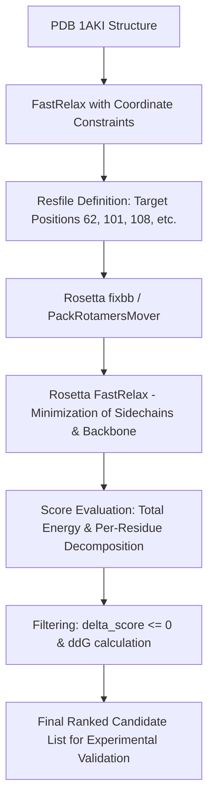

# Lysozyme (HEWL) Enzyme Redesign Memo

**Target System:** Hen Egg-White Lysozyme (HEWL, PDB: `1AKI` / `1HEW`)  
**EC Number:** 3.2.1.17 (Peptidoglycan $N$-acetylmuramoylhydrolase)  
**Objective:** Rational active-site pocket engineering to tune substrate binding affinity and subsite specificity without disrupting fold stability or catalytic acid/base machinery.

---

## 1. Biological & Structural Context

### 1.1 Catalytic Machinery
Lysozyme catalyzes the hydrolysis of 1,4-$\beta$-linkages between $N$-acetylmuramic acid (NAM) and $N$-acetylglucosamine (NAG) in peptidoglycan.

- **`Glu35`**: General acid catalyst. Resides in a hydrophobic microenvironment giving it an elevated $\text{p}K_a \approx 6.2$. **CRITICAL: Invariant / Must not be mutated directly.**
- **`Asp52`**: Nucleophile / electrostatic stabilizer for the oxocarbenium ion transition state. Highly solvent accessible, $\text{p}K_a \approx 3.7$. **CRITICAL: Invariant / Must not be mutated directly.**

### 1.2 Subsite Binding Anatomy (Subsites A through F)
Subsite D is where sugar distortion occurs (boat/sofa conformation) during catalysis.
- **Subsite A-C (Upper cleft):** `Trp62`, `Trp63`, `Asp101`, `Asn59`. Governs initial recognition of (NAG)$_n$ oligosaccharides.
- **Subsite D (Cleavage site):** `Val109`, `Gln57`, `Ala107`, `Trp108`. Tight steric constraints to force ring distortion.
- **Subsite E-F (Leaving group):** `Arg45`, `Asn46`, `Arg68`, `Arg112`. Electrostatic steering and polar interactions.

---

## 2. Design Hypotheses

| ID | Position | WT | Mutant | Target Subsite | Primary Design Rationale | Risk / Trade-off |
|---|---|---|---|---|---|---|
| **M1** | 62 | `Trp` | `Tyr` | Subsite B | Modulate aromatic stacking with NAG ring; slightly reduces steric bulk while retaining H-bonding capacity via phenoxy -OH. | Moderate: Slight drop in binding affinity for wild-type hexasaccharide. |
| **M2** | 101 | `Asp` | `Asn` | Subsite A | Remove negative charge at entrance to reduce repulsion with acidic substrates (e.g., partially deacetylated peptidoglycan) while maintaining H-bond network. | Low: Well-tolerated in natural variants; slight modulation of subsite A binding. |
| **M3** | 108 | `Trp` | `Phe` | Subsite D | Relieve steric crowding adjacent to `Glu35` to accommodate modified sugar derivatives at subsite D without destabilizing the catalytic geometry. | Moderate/High: May affect transition-state distortion if packing against `Glu35` is perturbed. |
| **M4** | 59 | `Asn` | `Ser` | Subsite B/C | Open up the cleft edge slightly, increasing solvent flexibility for branched oligosaccharide substrates. | Low: Minor local stability perturbation. |
| **M5** | 45 | `Arg` | `Lys` | Subsite E | Preserve positive electrostatic potential for substrate steering while increasing side-chain conformational flexibility. | Low: Very safe conservative substitution. |

---

## 3. Prioritized Design Ranking

1. **`Asp101Asn` (M2)** — **Priority 1 (Highest Confidence)**: Conservative polar substitution. Removes negative charge penalty for anionic or modified polymers without risking the active core.
2. **`Trp62Tyr` (M1)** — **Priority 2 (High Impact)**: Directly tunes the primary carbohydrate recognition clamp at subsite B.
3. **`Arg45Lys` (M5)** — **Priority 3 (Safe Modulator)**: Leaves-group subsite optimization; conservative isosteric/isoelectric change.
4. **`Asn59Ser` (M4)** — **Priority 4 (Exploratory)**: Cleft-widening mutation for bulkier substrates.
5. **`Trp108Phe` (M3)** — **Priority 5 (High Risk / High Reward)**: Intimately tied to subsite D sugar ring deformation; evaluate with thorough backbone relaxation first.

---

## 4. Rosetta Computational Protocol Plan

---

## 5. Wet-Lab Validation Plan

1. **Expression & Purification:** Recombinant expression in *E. coli* or *Pichia pastoris*, followed by cation-exchange chromatography (e.g., SP-Sepharose).
2. **Thermal Stability Assay:** Differential Scanning Fluorimetry (DSF / nanoDSF) or Circular Dichroism (CD) melting temperature ($T_m$) to confirm stability ($\Delta T_m \ge -2^\circ\text{C}$ threshold).
3. **Kinetic Assays:**
   - *Micrococcus lysodeikticus* turbidity clearance assay for bulk bactericidal activity ($V_{\max}, K_m$).
   - 4-Methylumbelliferyl-$\beta$-D-glycoside fluorogenic oligosaccharide assay for individual subsite cleavage rates ($k_{\text{cat}}/K_m$).
