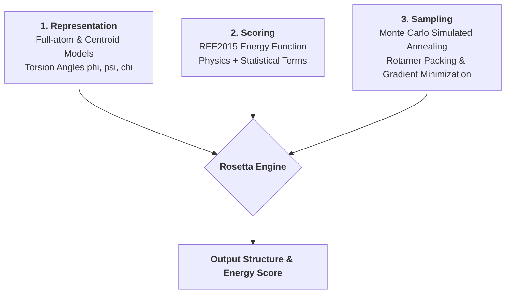
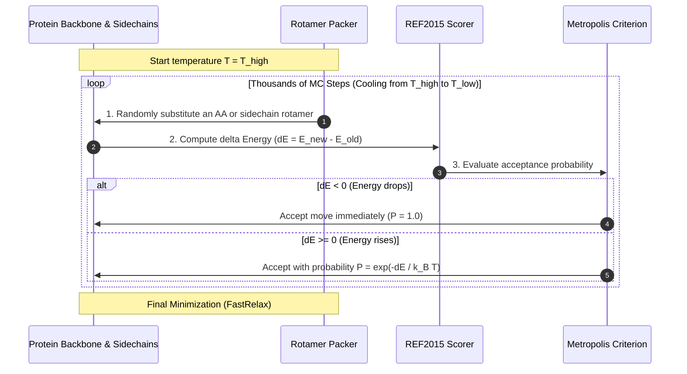
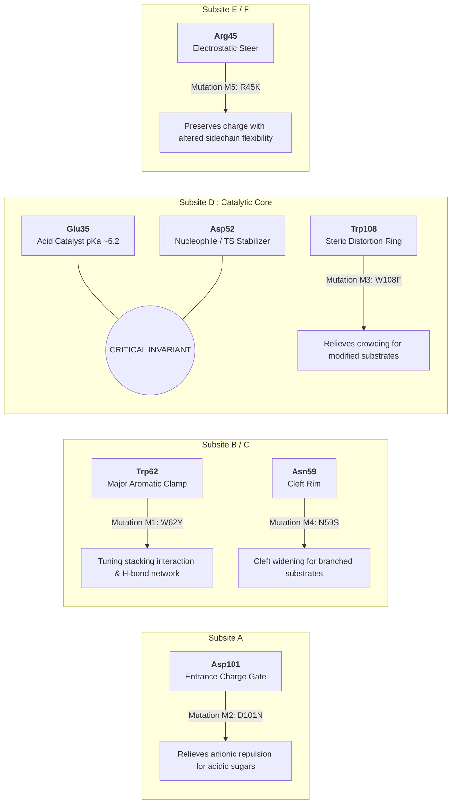

# The Complete Guide to Rosetta & Computational Enzyme Design

This document provides a comprehensive, visual explanation of how **Rosetta** works under the hood and how it is applied to **computational enzyme engineering**.

---

## 1. The Core Trinity of Rosetta

Every protocol in Rosetta—whether structure prediction, protein-protein docking, loop modeling, or enzyme design—relies on three foundational components:



### 1.1 Representation (Internal Coordinate Space)
Proteins in Rosetta are parameterized primarily by their **dihedral (torsion) angles**:
- **Backbone:** $\phi$ (phi), $\psi$ (psi), $\omega$ (omega)
- **Sidechain:** $\chi_1, \chi_2, \chi_3, \chi_4$ (chi angles)

Bond lengths and bond angles are generally held fixed at ideal values during packing, dramatically reducing the search space from $3N$ cartesian coordinates to a compact set of torsional degrees of freedom.

---

## 2. The Rosetta Score Function (REF2015)

The total score $E_{\text{total}}$ is a linear combination of physical and statistical potentials:

$$E_{\text{total}} = \sum_{i} w_i \cdot S_i(\text{structure})$$

Where $w_i$ is the optimized weight and $S_i$ is the individual energy term.

```mermaid
mindmap
  root((<b>Rosetta Energy Terms (REF2015)</b>))
    Van der Waals
      fa_atr (Attractive forces / packing)
      fa_rep (Steric clashes / repulsive)
    Solvation & Electrostatics
      fa_sol (Lazaridis-Karplus implicit solvation)
      fa_elec (Coulombic electrostatic interactions)
    Hydrogen Bonding
      hbond_lr_bb (Long-range backbone-backbone)
      hbond_sr_bb (Short-range backbone-backbone / alpha-helix)
      hbond_bb_sc (Backbone-sidechain)
      hbond_sc (Sidechain-sidechain)
    Torsional & Conformational
      rama_prepro (Ramachandran backbone propensity)
      fa_dun (Dunbrack rotamer probability)
      p_aa_pp (Amino acid probability given phi/psi)
      omega (Peptide bond planarity)
```

### Key Energy Terms Explained
1. **`fa_atr` & `fa_rep` (Lennard-Jones 6-12 Potential):**
   $$E_{\text{LJ}}(r) = \epsilon \left[ \left(\frac{r_0}{r}\right)^{12} - 2\left(\frac{r_0}{r}\right)^6 \right]$$
   Evaluates atomic packing. To allow sampling over shallow steric clashes, Rosetta dampens the repulsive $r^{-12}$ slope near the collision boundary.
2. **`fa_sol` (Implicit Solvation):** Penalizes burying polar atoms without hydrogen bonds; rewards burying hydrophobic residues (driving the hydrophobic core formation).
3. **`fa_elec` (Coulombic Electrostatics):** Screened electrostatic potential with distance-dependent dielectric $\epsilon(r)$.
4. **`fa_dun` (Dunbrack Rotamer Library):** Penalizes rare or strained side-chain dihedral conformations ($\chi$ angles) based on crystallographic statistics:
   $$E_{\text{dun}} = -\ln P(\chi_1, \chi_2, \dots \mid \phi, \psi, \text{AA})$$

---

## 3. How Sampling Works: Packing & Monte Carlo

Rosetta explores sequence and conformation space using **Monte Carlo with Simulated Annealing (MCMC)**:



---

## 4. Computational Enzyme Design (EnzDes) Workflow

Enzyme design differs from standard protein design because catalytic function requires **sub-angstrom geometric precision** for the transition state.

```mermaid
flowchart TD
    subgraph Step 1: Quantum Chemistry & Theozyme
        QM[QM / DFT Transition State Modeling] --> Theo[Define <b>Theozyme</b>:<br>Ideal distances, angles, & dihedrals to catalytic atoms]
    end

    subgraph Step 2: Scaffold Selection & Matching
        Scaffold[PDB Scaffold Library] --> Matcher[<b>Rosetta Matcher</b>:<br>Searches scaffold backbone for positions capable of hosting catalytic residues]
        Theo --> Matcher
    end

    subgraph Step 3: Sequence Design & Pocket Optimization
        Matcher --> Resfile[Generate <b>Resfile</b>:<br>Fix catalytic residues, redesign pocket, repack neighbors]
        Resfile --> Pack[<b>PackRotamersMover</b> / fixbb:<br>Introduce mutations to optimize transition state binding]
    end

    subgraph Step 4: Constrained Relaxation & Filtering
        Pack --> CstRelax[<b>FastRelax with Catalytic Constraints</b>]
        CstRelax --> Filter[<b>Multi-Parameter Filtering:</b><br>- Total Score (REU)<br>- Ligand ddG & Binding Energy<br>- Catalytic Constraint Satisfaction<br>- Buried Unsatisfied H-bonds]
    end

    Filter --> Candidate[Top Ranked Designs for Experimental Testing]
```

---

## 5. Lysozyme Active-Site Engineering Map

In our Hen Egg-White Lysozyme (`1AKI`) engineering project:



---

## 6. Rosetta Control Files (Resfile & RosettaScripts XML)

### 6.1 Resfile Syntax (`lysozyme_design.resfile`)
A **resfile** controls what Rosetta is allowed to do at each residue position during packing:

```text
# Global default: Pack existing amino acid sidechains (repack only, no mutations)
AUTO
start

# Target Mutation Positions:
# Position 62 on Chain A: mutate to Tyrosine (Y) or keep Trp (W)
62 A PIKAA Y W

# Position 101 on Chain A: mutate to Asparagine (N) or Aspartate (D)
101 A PIKAA N D

# Position 108 on Chain A: mutate to Phenylalanine (F) or Trp (W)
108 A PIKAA F W

# Position 45 on Chain A: mutate to Lysine (K) or Arg (R)
45 A PIKAA K R

# Invariant Catalytic Residues: Never mutate or change identity, allow only repacking
35 A NATAA
52 A NATAA
```

*Commands:*
- `NATAA`: Native Amino Acid (keep wild-type identity, allow rotamer repacking).
- `NATRO`: Native Amino Acid & Rotamer (freeze completely; no mutation, no repacking).
- `ALLAA`: Allow all 20 standard amino acids (de novo design).
- `PIKAA <letters>`: Pick specific allowed amino acids.

### 6.2 RosettaScripts XML (`enzyme_design.xml`)
RosettaScripts allows modular composition of movers, filters, and scoring functions:

```xml
<ROSETTASCRIPTS>
    <SCOREFXNS>
        <!-- Standard REF2015 energy function with catalytic constraints enabled -->
        <ScoreFunction name="ref2015_cst" weights="ref2015">
            <Reweight scoretype="atom_pair_constraint" weight="1.0"/>
            <Reweight scoretype="angle_constraint" weight="1.0"/>
            <Reweight scoretype="dihedral_constraint" weight="1.0"/>
        </ScoreFunction>
    </SCOREFXNS>

    <TASKOPERATIONS>
        <!-- Load the resfile defining design and repacking rules -->
        <ReadResfile name="rrf" filename="lysozyme_design.resfile"/>
        <!-- Include extra rotamers for chi1 and chi2 angles to improve packing sampling -->
        <ExtraRotamersGeneric name="ex_rot" ex1="1" ex2="1" extrachi_cutoff="0"/>
    </TASKOPERATIONS>

    <MOVERS>
        <!-- Sidechain packing with simulated annealing -->
        <PackRotamersMover name="packer" scorefxn="ref2015_cst" task_operations="rrf,ex_rot"/>
        <!-- Backbone + sidechain minimization with coordinate constraints to prevent unfolding -->
        <FastRelax name="relax" scorefxn="ref2015_cst" task_operations="rrf,ex_rot" repeats="3"/>
    </MOVERS>

    <PROTOCOLS>
        <Add mover_name="packer"/>
        <Add mover_name="relax"/>
    </PROTOCOLS>
</ROSETTASCRIPTS>
```

---

## 7. Command-Line Execution

To run this protocol using Rosetta:

```powershell
# Run RosettaScripts with the prepared XML, PDB structure, and resfile
rosetta_scripts.default.linuxgccrelease `
    -s input/1AKI_clean.pdb `
    -parser:protocol enzyme_design.xml `
    -nstruct 100 `
    -out:file:scorefile score_lysozyme_designs.sc `
    -out:path:all output_models/
```

- `-s`: Starting input PDB structure.
- `-nstruct 100`: Generate 100 independent Monte Carlo trajectories.
- `-out:file:scorefile`: Save per-trajectory energy scores and metrics to a tabular file.
